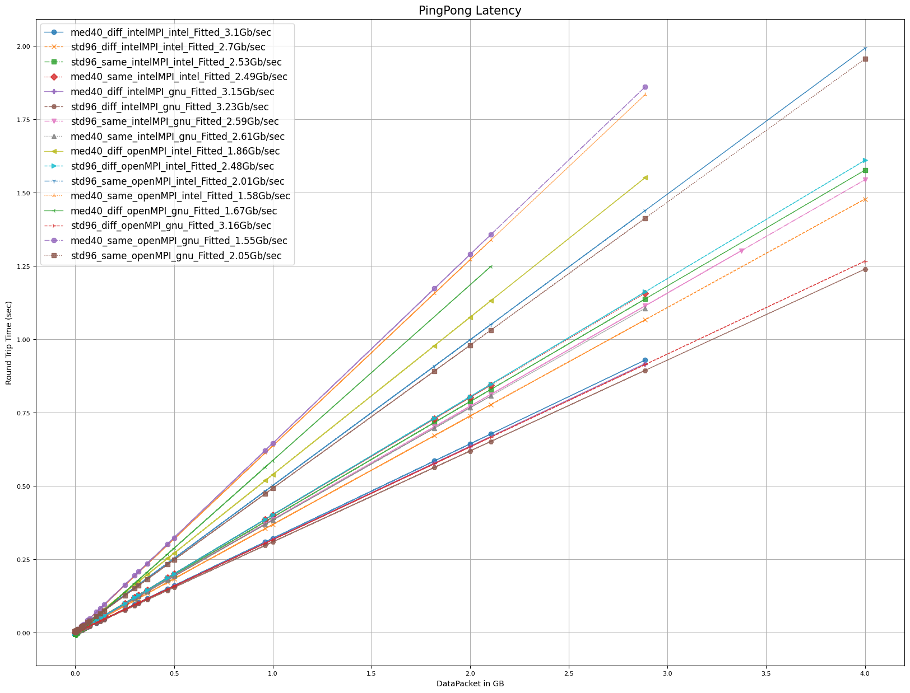

# Project Overview

This project implements a data transfer program using OpenMPI and IntelMPI, coded in C, for communication between compute nodes. The program is managed by the SLURM workload manager. Additionally, the project includes a Python pipeline designed for quantitative analysis and benchmarking of transfer data.

## Features

- C-Based Data Transfer: Implemented with both OpenMPI and IntelMPI for efficient communication between compute nodes.
- SLURM Integration: Utilizes SLURM for managing and scheduling tasks across the compute cluster.
- Python Analytics: A comprehensive pipeline for analyzing and benchmarking transfer data, providing valuable insights into performance metrics.

## Code Layout

- Analysis_python_transferData: Contains [Python scripts](Analysis_python_transferData/transferAnalysis/dataUtility.py) dedicated to [data transfer analytics](Analysis_python_transferData/transferAnalysis/transfer.ipynb) and benchmarking.
- **PingPongLatency**: Root directory containing the C-based data transfer code. [intelMPI Code](PingPongLatency/intelMPI/pingPongV3.c), [openMPI Code](PingPongLatency/openMPI/pingPongV3.c), 
    - **intelMPI / openMPI**: C-based data transfer code utilizing IntelMPI or OpenMPI packages.
        - **intelCompiler / gnuCompiler**: Used for compiling the C code with either Intel's compiler or GCC (GNU Compiler Collection).
            - **diff / same**: Batch scripts for conducting inter-node (diff) and intra-node (same) data transfers. [interNode batch script](PingPongLatency/intelMPI/gnuCompiler/diff/med40_diff_intelMPI_gnu/_jobScript.sh), [intraNode batch script](PingPongLatency/intelMPI/gnuCompiler/same/med40_same_intelMPI_gnu/_jobScript.sh)
